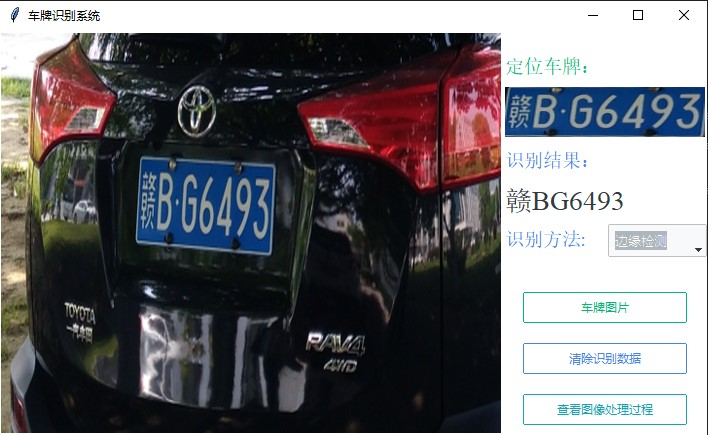
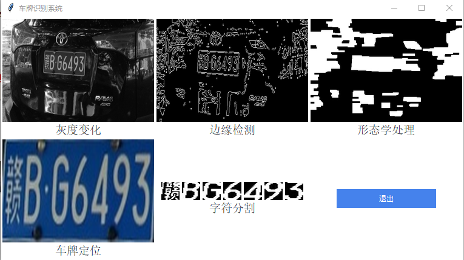

# Python opencv 车牌识别

+ 视觉检测技术大作业
+ Python3+OpenCV
+ 使用tkinter搭建界面
+ `tmp/`文件夹是数字图像处理过程
+ `chepai/`文件夹是车牌图片
+ `pic/`文件夹是程序界面图
+ exe.zip解压后可直接在Windows系统下直接执行（不用配环境）。
+ 边缘检测尚未优化完成，因此识别率较低，识别不出来的图片可以切换AI识别。

## 开发环境配置
> `pip install numpy`

> `pip install pillow`

> `pip install opencv-python`
>
> pip install hyperlpr3

## 图片展示

## 参考链接

Hyper开源链接：https://github.com/szad670401/HyperLPR/blob/master/README_CH.md

原作者链接：https://github.com/Chao2020x/license-plate-recognition